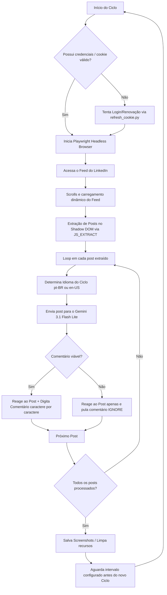

# 🤖 OpenClaw LinkedIn Engagement Agent

> Uma automação inteligente, segura e humanizada para engajamento estratégico no LinkedIn, combinando **Playwright** para simulação de navegação, **FastAPI** para controle em tempo real e o modelo **Gemini 3.1 Flash Lite** para geração de comentários contextuais e autênticos.

---

## 📋 Índice
1. [Visão Geral](#-visão-geral)
2. [Arquitetura e Fluxo de Execução](#-arquitetura-e-fluxo-de-execução)
3. [Principais Funcionalidades](#-principais-funcionalidades)
4. [Segurança e Privacidade de Credenciais](#-segurança-e-privacidade-de-credenciais)
5. [Como Executar](#-como-executar)
   - [Pré-requisitos](#pré-requisitos)
   - [Instalação Local (CLI)](#instalação-local-cli)
   - [Executando via Docker Compose (Recomendado)](#executando-via-docker-compose-recomendado)
6. [Interface Web (FastAPI)](#-interface-web-fastapi)
7. [Simulação de Comportamento Humano (Bypass de Detecção)](#-simulação-de-comportamento-humano-bypass-de-detecção)
8. [Diretrizes de Engajamento do Agente](#-diretrizes-de-engajamento-do-agente)
9. [Estrutura de Arquivos](#-estrutura-de-arquivos)

---

## 🔍 Visão Geral

O **OpenClaw LinkedIn Engagement Agent** foi projetado para manter perfis ativos e relevantes no LinkedIn de forma totalmente orgânica e natural. Em vez de simplesmente comentar em todas as publicações com respostas genéricas, o agente utiliza IA de ponta para analisar criticamente cada post. Ele decide se o conteúdo é pertinente ao nicho profissional do usuário e, caso seja, gera um comentário personalizado, estruturado e conciso (de 1 a 3 frases) em Português ou Inglês.

---

## 🛠️ Arquitetura e Fluxo de Execução

O diagrama a seguir descreve o ciclo de funcionamento do agente:



---

## ✨ Principais Funcionalidades

- **Interação no Shadow DOM**: Scraper robusto em Javascript puro para navegar e capturar elementos dentro do Shadow DOM do LinkedIn, evitando falhas com atualizações de layout.
- **Engajamento Bilíngue Inteligente**: Sorteio probabilístico inteligente a cada ciclo (maioria 66% e minoria 33%) entre **Português (pt-BR)** e **Inglês (en-US)** para simular uma atuação profissional natural e globalizada.
- **Painel de Controle Amigável**: Dashboard interativo desenvolvido em FastAPI para iniciar/parar o agente, monitorar logs ao vivo e visualizar métricas acumuladas de execução (reações, comentários e posts processados).
- **Renovação de Sessão Automatizada**: Módulo [refresh_cookie.py](file:///c:/Users/Thiago/Documents/scan_MAC/openclaw-linkedin/refresh_cookie.py) capaz de efetuar o fluxo de login de forma automática caso o cookie de sessão expire.

---

## 🔒 Segurança e Privacidade de Credenciais

A segurança da sua conta é prioridade número um. O projeto suporta duas abordagens para gerenciar credenciais de acesso:

### 1. Zero-Disk Storage (Apenas em Memória RAM) — Pelo Painel Web
Quando você utiliza o painel web (FastAPI) para definir seu e-mail, senha, chave do Gemini ou cookie `li_at`, esses dados são mantidos **exclusivamente na memória RAM** do servidor.
- **Sem gravação em disco**: Nenhum arquivo de configuração ou banco de dados é criado para armazenar credenciais sensíveis.
- **Exclusão total**: Assim que o agente termina a execução ou o botão de limpeza é acionado, as credenciais são permanentemente removidas da memória RAM.

### 2. Arquivo Local `.env` — Para Execução Direta CLI
Para quem prefere rodar via terminal clássico, o agente lê as configurações do arquivo `.env` (que está listado no arquivo `.gitignore` para nunca ser enviado ao repositório público).

---

## 🚀 Como Executar

### Pré-requisitos
- Python 3.10 ou superior instalado localmente.
- Docker e Docker Compose (caso prefira rodar em container).

### Instalação Local (CLI)

1. Clone o repositório e acesse a pasta do projeto:
   ```bash
   git clone <URL_DO_REPOSITORIO>
   cd openclaw-linkedin
   ```

2. Crie e ative um ambiente virtual:
   ```bash
   python -m venv venv
   # No Windows:
   venv\Scripts\activate
   # No Linux/macOS:
   source venv/bin/activate
   ```

3. Instale as dependências e o Playwright:
   ```bash
   pip install -r requirements.txt
   playwright install chromium
   ```

4. Configure o arquivo `.env` a partir do modelo:
   ```bash
   # Crie um arquivo .env na raiz do projeto e configure:
   LINKEDIN_LI_AT=seu_cookie_li_at_aqui
   LLM_API_KEY=sua_gemini_api_key_aqui
   
   # Opcionais para auto-renovação de cookie:
   LINKEDIN_EMAIL=seu_email@exemplo.com
   LINKEDIN_PASSWORD=sua_senha_aqui
   ```

5. Execute o agente CLI:
   ```bash
   python agent.py
   ```

### Executando via Docker Compose (Recomendado)

O Docker simplifica toda a instalação das dependências do sistema necessárias para o Chromium (Playwright).

1. Construa e inicie o container em segundo plano:
   ```bash
   docker-compose up -d --build
   ```

2. Acesse o painel web do agente em:
   ```
   http://localhost:8080
   ```

3. Acompanhe os logs da execução em tempo real:
   ```bash
   docker-compose logs -f
   ```

---

## 🖥️ Interface Web (FastAPI)

A interface gráfica no endereço `http://localhost:8080` (definida em [server.py](file:///c:/Users/Thiago/Documents/scan_MAC/openclaw-linkedin/server.py)) permite:
- **Gerenciamento de Fluxo**: Iniciar e parar ciclos de engajamento dinamicamente.
- **Configuração de Parâmetros**: Ajustar o número total de ciclos e o intervalo de tempo em minutos entre cada ciclo.
- **Logs detalhados**: Caixa de texto com atualização contínua exibindo as ações que o agente está realizando em tempo real.
- **Visualização de Estatísticas**: Contador com posts analisados, reações feitas e comentários enviados.

---

## ⏱️ Simulação de Comportamento Humano (Bypass de Detecção)

Para evitar restrições do algoritmo do LinkedIn, o agente conta com uma camada rigorosa de **atrasos aleatórios personalizáveis** configurada no arquivo [timer_config.json](file:///c:/Users/Thiago/Documents/scan_MAC/openclaw-linkedin/timer_config.json) e gerenciada pela classe [RandomTimer](file:///c:/Users/Thiago/Documents/scan_MAC/openclaw-linkedin/random_timer.py#L74):

| Ação | Atraso Mínimo | Atraso Máximo | Finalidade |
| :--- | :---: | :---: | :--- |
| `feed_loading` | 8.0s | 15.0s | Espera de renderização inicial do feed |
| `scroll_delay` | 1.0s | 4.0s | Intervalo entre rolagem de páginas |
| `typing_char` | 15ms | 50ms | Simulação de digitação caractere por caractere |
| `reaction_to_comment` | 2.0s | 8.0s | Tempo para "ler" antes de começar a comentar |
| `comment_submission` | 1.0s | 3.0s | Pausa antes de clicar no botão "Publicar" |
| `post_processing` | 1.0s | 5.0s | Tempo de transição para o próximo post |

---

## 🧠 Diretrizes de Engajamento do Agente

O comportamento do modelo Gemini 3.1 Flash Lite é estritamente controlado pelo arquivo [instructions.md](file:///c:/Users/Thiago/Documents/scan_MAC/openclaw-linkedin/instructions.md). O agente segue estas regras de ouro:

### 🟢 O que o agente FAZ:
- Mantém um tom profissional, autêntico e natural.
- Comenta de forma sucinta (1-3 frases), referenciando pontos específicos e trazendo valor prático.
- Prioriza reações padrão (curtir/like).
- Responde com base no idioma sorteado para garantir coerência.

### 🔴 O que o agente NÃO FAZ:
- **Não** usa linguagem clichê corporativa ou hashtags em excesso.
- **Não** usa emojis de forma exagerada ou caricata.
- **Não** repete o mesmo comentário em posts diferentes.
- **Não** interage com conteúdos ofensivos, políticos, desinformação ou fora do seu nicho profissional.
- **Não** assina comentários artificialmente ou força links promocionais.

---

## 📁 Estrutura de Arquivos

- [agent.py](file:///c:/Users/Thiago/Documents/scan_MAC/openclaw-linkedin/agent.py): Motor principal de automação com Playwright.
- [server.py](file:///c:/Users/Thiago/Documents/scan_MAC/openclaw-linkedin/server.py): API FastAPI que expõe os endpoints de controle e armazena credenciais em memória.
- [refresh_cookie.py](file:///c:/Users/Thiago/Documents/scan_MAC/openclaw-linkedin/refresh_cookie.py): Utilitário de login e atualização automática do cookie `li_at`.
- [random_timer.py](file:///c:/Users/Thiago/Documents/scan_MAC/openclaw-linkedin/random_timer.py): Gerenciador de atrasos randômicos.
- [instructions.md](file:///c:/Users/Thiago/Documents/scan_MAC/openclaw-linkedin/instructions.md): System instructions (regras de tom, estilo e filtros do agente).
- [templates/index.html](file:///c:/Users/Thiago/Documents/scan_MAC/openclaw-linkedin/templates/index.html): Código front-end do painel de monitoramento.
- [timer_config.json](file:///c:/Users/Thiago/Documents/scan_MAC/openclaw-linkedin/timer_config.json): Parâmetros de atraso configuráveis.

---

## ⚖️ Licença

Este projeto é desenvolvido para fins educacionais e de pesquisa sobre automação segura de navegadores. O uso inadequado desta ferramenta pode violar os termos de serviço do LinkedIn. Utilize com responsabilidade.
